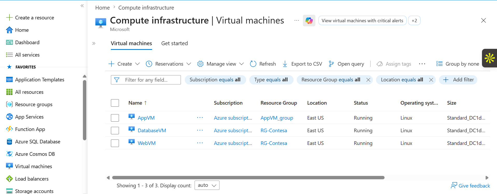
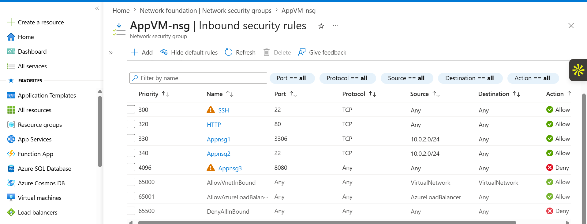
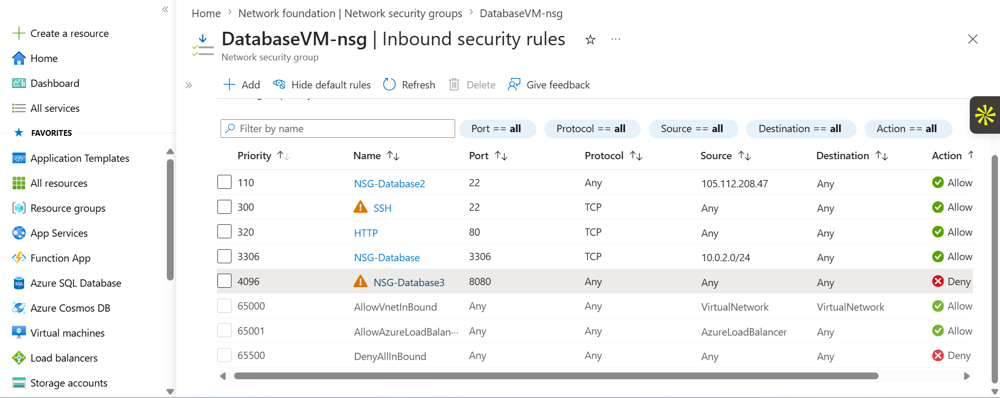
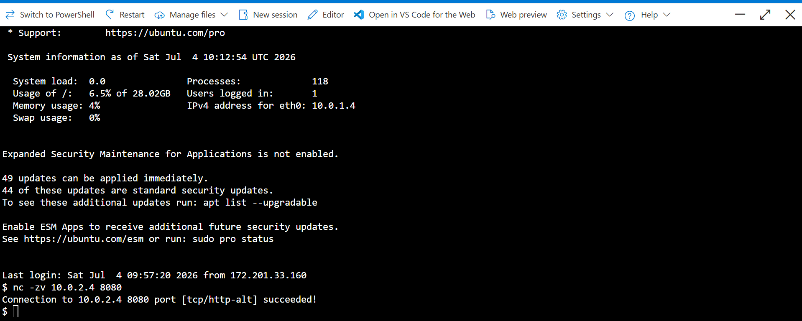
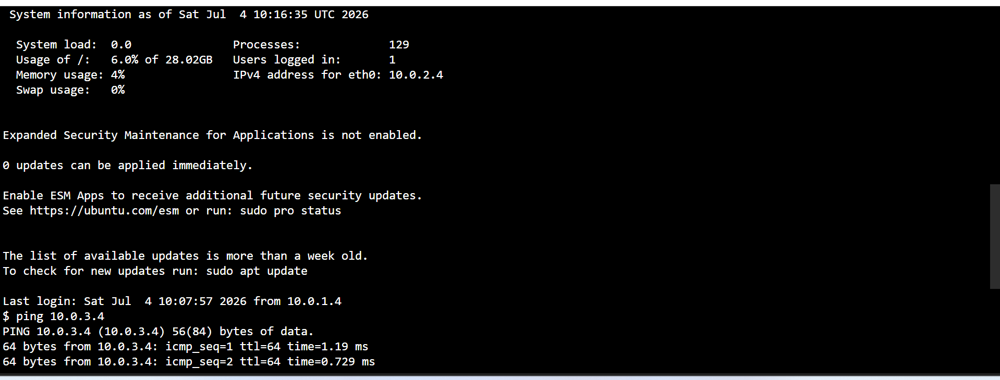
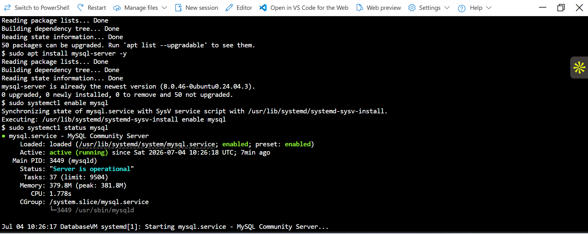
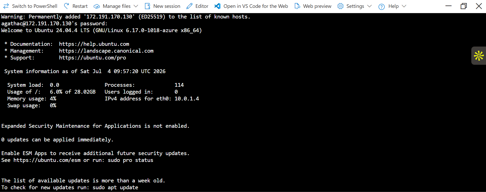
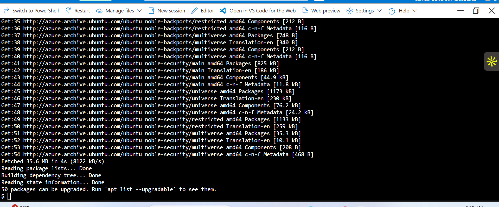

# Azure Secure Three-Tier Network

## Project Overview

This project demonstrates the deployment of a secure three-tier architecture in Microsoft Azure using Virtual Networks, Subnets, Network Security Groups (NSGs), Linux Virtual Machines, Apache Web Server, and MySQL.

The environment was designed to separate the Web, Application, and Database tiers while enforcing secure communication between them using Azure networking and security best practices.

---

## Architecture


---

## Architecture Components

### Web Tier
- Ubuntu Linux Virtual Machine
- Apache Web Server
- Public access on HTTP (Port 80)
- SSH access restricted to my public IP

### Application Tier
- Ubuntu Linux Virtual Machine
- Python HTTP Server running on Port 8080
- Accessible only from the Web subnet
- Internal communication only

### Database Tier
- Ubuntu Linux Virtual Machine
- MySQL Server installed and running
- Port 3306 accessible only from the Application subnet
- No public database access

---

## Azure Services Used

- Azure Virtual Network (VNet)
- Subnets
- Network Security Groups (NSGs)
- Linux Virtual Machines
- Public IP Addresses
- Network Interfaces
- SSH
- Azure Cloud Shell

---

## Network Design

| Tier | Subnet | Purpose |
|-------|---------|---------|
| Web | WebSubnet | Hosts the Apache web server |
| Application | AppSubnet | Hosts the application server |
| Database | DatabaseSubnet | Hosts the MySQL database |

Traffic Flow:

```
Internet
    │
    ▼
Web VM
    │
    ▼
Application VM
    │
    ▼
Database VM
```

---

## Security Configuration

### Web VM
- SSH allowed only from my public IP
- HTTP (Port 80) allowed from the Internet

### Application VM
- Port 8080 allowed only from the Web subnet
- No public application access

### Database VM
- MySQL Port 3306 allowed only from the Application subnet
- Database isolated from the Internet

---

## Connectivity Testing

The following tests were performed successfully:

- SSH connectivity
- Web server accessibility
- Application server connectivity on Port 8080
- Ping between virtual machines
- MySQL service verification
- Network Security Group validation
- Port connectivity testing using Netcat (nc)

---

## Project Screenshots

### Virtual Machines



### Web VM NSG Rules


### App VM NSG Rules



### Database VM NSG Rules



### Application Server Running


### Application Connectivity Test



### Database Port Test


### Ping Test



### MySQL Running



### Database MySQL Status



### APT Update



---

## Skills Demonstrated

- Azure Virtual Networking
- Azure Network Security Groups
- Linux Administration
- Apache Web Server
- MySQL Installation
- Network Troubleshooting
- SSH Administration
- Azure Infrastructure
- Cloud Security
- Infrastructure Documentation

---

## Repository Structure

```
Azure-Secure-Three-Tier-Network/
│
├── scripts/
│   ├── apache-setup.sh
│   ├── app-server.sh
│   └── mysql-setup.sh
│
├── Architecture-Diagram.png
├── README.md
├── *.png
```

---

## Author

**Agatha Nweze**

Azure Cloud Support Engineer | Azure Administrator | Linux | Azure Networking

GitHub:
https://github.com/Acnweze
