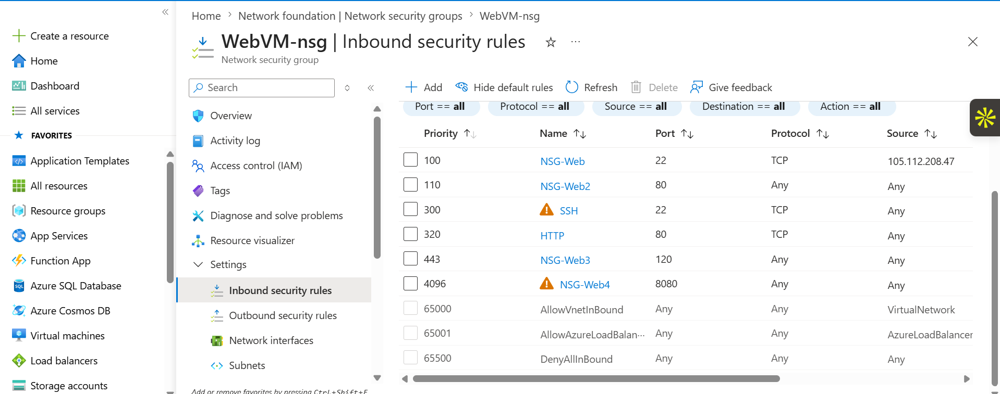
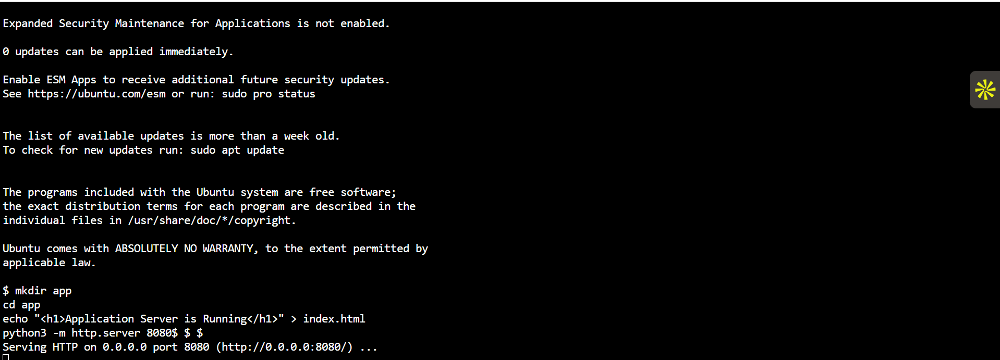
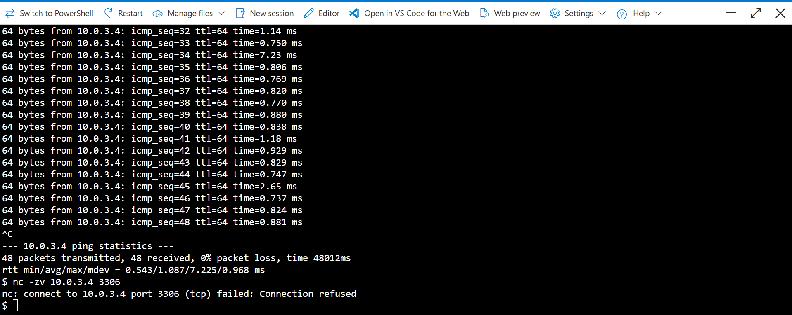

# Azure Secure Three-Tier Network

## Project Overview

This project demonstrates how to build and secure a three-tier network architecture in Microsoft Azure using Virtual Networks (VNets), Subnets, Network Security Groups (NSGs), Ubuntu Linux Virtual Machines, Apache Web Server, and MySQL.

The objective was to design a secure environment where each application tier communicates only with the required tier while minimizing unnecessary exposure to the public internet.

---

## Architecture


### Architecture Flow

```text
Internet
    │
    ▼
Web VM (Web Subnet)
    │
    ▼
Application VM (App Subnet)
    │
    ▼
Database VM (Database Subnet)
```

---

## Azure Services Used

- Azure Virtual Network (VNet)
- Subnets
- Network Security Groups (NSGs)
- Ubuntu Linux Virtual Machines
- Public IP Addresses
- Network Interfaces
- Azure Cloud Shell
- SSH

---

## Network Design

| Tier | Subnet | Purpose |
|------|---------|---------|
| Web | WebSubnet | Hosts the Apache Web Server |
| Application | AppSubnet | Hosts the Python Application |
| Database | DatabaseSubnet | Hosts the MySQL Database |

---

## Security Configuration

### Web Tier

- Apache Web Server
- Public HTTP access
- SSH restricted to my public IP

### Application Tier

- Python HTTP Server running on Port 8080
- Accessible only from the Web subnet
- No direct public access

### Database Tier

- MySQL Server
- Port 3306 restricted to the Application subnet
- No Internet access

---

## Connectivity Tests

The following tests were completed successfully:

- SSH into Web VM
- Web VM → Application VM connectivity
- Application VM → Database VM connectivity
- Python server running on Port 8080
- MySQL installation and service verification
- Network Security Group validation
- Port testing using Netcat (`nc`)
- ICMP testing using `ping`

---

## Project Screenshots

### Virtual Machines


### Web VM NSG



### Application VM NSG


### Database VM NSG


### Application Server Running



### Application Connectivity Test


### Database Connectivity Test



### Ping Test


### MySQL Running


---

## Skills Demonstrated

- Azure Networking
- Azure Virtual Networks
- Azure Network Security Groups
- Linux Administration
- SSH
- Apache Web Server
- MySQL
- Network Troubleshooting
- Infrastructure Security
- Cloud Infrastructure Documentation

---

## Repository Structure

```text
Azure-Secure-Three-Tier-Network/
│
├── README.md
├── images/
├── scripts/
│   ├── apache-setup.sh
│   ├── app-server.sh
│   └── mysql-setup.sh
```

---

## Key Learning Outcomes

- Designed a secure three-tier Azure network.
- Configured Network Security Groups to control traffic between tiers.
- Deployed and managed Ubuntu virtual machines.
- Tested secure communication between application tiers.
- Practiced Linux administration and network troubleshooting in Azure.

---

## Author

**Agatha Nweze**

**Azure Cloud Support Engineer | Azure Administrator | Linux | Azure Networking**

GitHub: https://github.com/Acnweze
